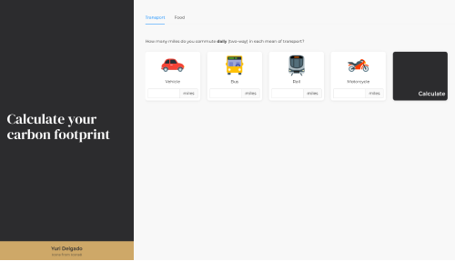
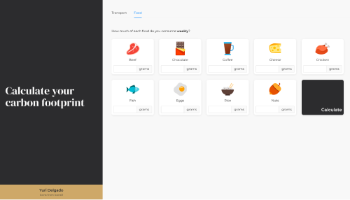

# Personal Carbon Footprint Calculator

References:

- https://ghgprotocol.org/sites/default/files/standards/Scope3_Calculation_Guidance_0.pdf -
  p. 89, Calculation formula [7.1] Distance-based method
- https://www.epa.gov/sites/production/files/2020-04/documents/ghg-emission-factors-hub.pdf -
  Table 10 - Scope 3 Category 6: Business Travel and Category 7: Employee Commuting
- https://ourworldindata.org/carbon-footprint-food-methane -
  Emission factors for foods
